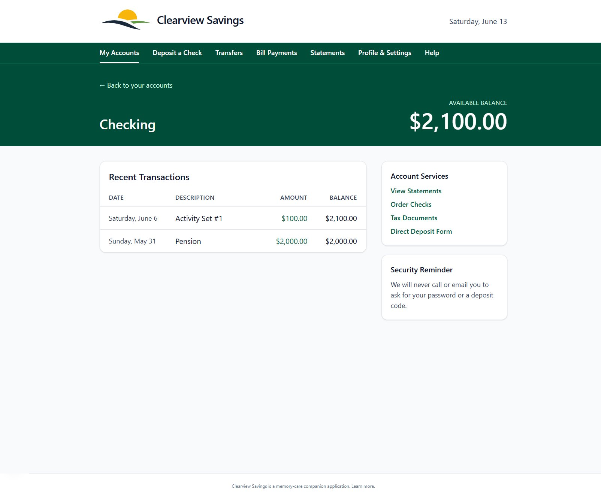
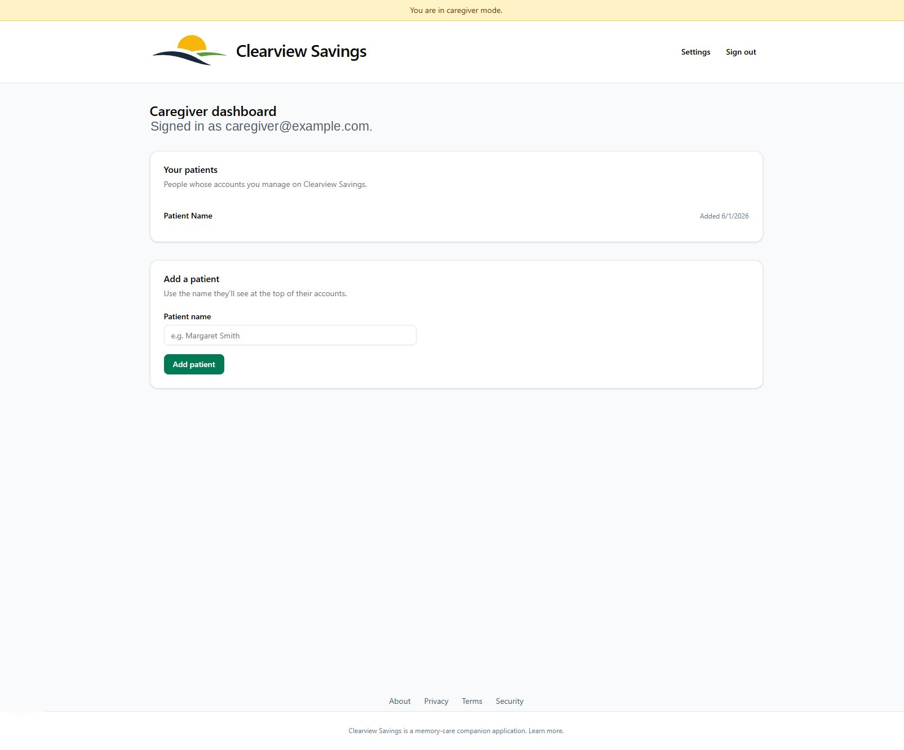

# Clearview Savings

A simulated banking application for people living with Alzheimer's and
other forms of dementia. The patient sees a familiar, realistic banking
interface they can check whenever they worry about money; their caregiver
controls balances, scheduled deposits, and printable check deposits from a
separate admin view behind the scenes.

This is a tool for **therapeutic fibbing** — a recognized practice in
dementia care for reducing financial anxiety, the same idea behind the
simulated ATMs and prop wallets used in memory-care facilities. Clearview
Savings is **not a real financial institution**, never connects to real
money, and is used with the consent and involvement of the family or
caregiver.

> Every page the app serves carries a small, permanent footer disclosure —
> "Clearview Savings is a memory-care companion application. Learn more." —
> so regulators, crawlers, and family members always see what the service
> actually is, while the reassuring illusion sits on top for the patient.

## Screenshots

> The images below live in [`docs/screenshots/`](docs/screenshots/). If
> they appear broken, they haven't been captured yet — see
> [docs/screenshots/README.md](docs/screenshots/README.md) for the exact
> filenames and a step-by-step capture guide.

**Patient view** — large type, real-bank skeleton (greeting band, hero
balance, transaction table with a running-balance column):



**Caregiver view** — the admin panel, behind authentication:



> _More views (landing page, deposit wizard, patient home) live in
> [`docs/screenshots/`](docs/screenshots/)._

## How it works

- **Two completely separate surfaces.** The patient route group
  (`app/(patient)`) looks and feels like the online banking the patient
  remembers — no clinical vocabulary, no admin controls, ever. The
  caregiver route group (`app/(caregiver)`) is a standard, clearly
  labelled admin panel behind authentication.
- **Caregiver controls the money.** Balances, scheduled "direct deposits"
  (e.g. a pension or Social Security), and one-time deposit codes are all
  set by the caregiver. The patient simply sees the results.
- **Deposit a Check.** The caregiver generates a single-use code and prints
  a check (or a workbook reward, delivered *as* a check — see ADR 0004).
  The patient deposits it through a photo → amount → code wizard. The photo
  is accepted and immediately discarded; the amount comes from the code,
  never from image processing. There is no OCR and no real check imaging.
- **Computed on load, no cron for balances.** Scheduled deposits
  materialize into transactions when any account view is loaded, via an
  idempotent walk — no background job is required to keep balances current
  (see ADR 0001).
- **Multi-tenant from day one.** Every query is scoped to the owning
  caregiver through Postgres Row-Level Security. Money is always stored as
  integer cents — never floats.

## About the name

**Clearview Savings** is a fictional bank name. It does not impersonate any
real financial institution and deliberately avoids the words "bank,"
"banking," and "banker" (restricted under the Canadian Bank Act, Section
983, for non-licensed entities). The patient-facing brand is "Clearview
Savings" for **every** patient, permanently — there is no per-patient
brand override, by design and on legal grounds (see
[ADR 0002](docs/decisions/0002-no-per-patient-brand.md)). The UI stays on
a neutral palette (greys, navy, soft greens, warm beiges) and never
borrows a real bank's signature colors.

## Tech stack

- **Next.js 15** (App Router) + **React 19**, **TypeScript** (strict)
- **Tailwind CSS v4** + **shadcn/ui** (Radix primitives)
- **Supabase** — Postgres, Auth (incl. TOTP MFA), Row-Level Security
- **Drizzle ORM** + **Zod** validation
- **@react-pdf/renderer** for printable checks and workbooks
- **Resend** for transactional email, **Upstash Redis** for rate limiting,
  **Cloudflare Turnstile** for bot protection, **Sentry** for errors
- Deployed on **Vercel**

## Project structure

```
app/
  (marketing)/    Public landing + legal pages (/about, /privacy, /terms, /security)
  (auth)/         Sign-in / sign-up / password reset / MFA challenge
  (caregiver)/    Admin panel — patients, settings, audit log
  (patient)/      Patient-facing bank UI (desktop-dedicated)
  api/            Auth email hook, cron daily-digest, Sentry webhook
components/       Shared UI, including the required FooterDisclosure
lib/              Domain logic: deposit codes, scheduled deposits, running
                  balance, PDF generation, branding, Supabase clients, RLS
docs/
  specs/          Frozen pre-flight milestone specs (M{N}.md)
  milestones/     Implementation plans + progress/handoff docs
  decisions/      Architecture Decision Records (ADRs)
  screenshots/    Images used by this README
scripts/          Seed, migration, policy, and re-anchor helpers
```

## Local development

### Prerequisites

- **Node.js 20 or 22 LTS** (the project targets Next 15.5; Node 24 works
  but is newer than Next officially supports)
- **pnpm 10** (`corepack enable` will provide it)
- A **Supabase** project (local or hosted) for Postgres + Auth

### Setup

```bash
# 1. Install dependencies
pnpm install

# 2. Configure environment
cp .env.example .env.local      # then fill in real values

# 3. Apply the database schema and RLS policies
pnpm db:push                    # push the Drizzle schema
pnpm db:policies                # apply Row-Level Security policies

# 4. (optional) Seed a demo caregiver + patient
pnpm seed

# 5. Run the app
pnpm dev                        # http://localhost:3000
```

See [`.env.example`](.env.example) for the full list of environment
variables and what each one is for.

## Scripts

| Command            | What it does                                      |
| ------------------ | ------------------------------------------------- |
| `pnpm dev`         | Start the local dev server                        |
| `pnpm build`       | Production build                                  |
| `pnpm start`       | Serve the production build                         |
| `pnpm typecheck`   | `tsc --noEmit` (strict)                           |
| `pnpm lint`        | ESLint                                            |
| `pnpm test`        | Run the Vitest suite                              |
| `pnpm test:watch`  | Vitest in watch mode                              |
| `pnpm db:push`     | Push the Drizzle schema to the database           |
| `pnpm db:policies` | Apply Row-Level Security policies                 |
| `pnpm db:migrate`  | Apply a generated migration                       |
| `pnpm db:studio`   | Open Drizzle Studio                               |
| `pnpm seed`        | Seed a demo caregiver and patient                 |

Always run `pnpm typecheck && pnpm lint` before pushing.

## Testing

Vitest powers the suite, with tests co-located next to the code they
cover (`*.test.ts`). A subset of security tests exercises real Postgres
Row-Level Security via Testcontainers and is skipped unless Docker is
available (and `RUN_REAL_POSTGRES_TESTS` is set):

```bash
pnpm test                       # unit + integration
```

## Architecture decisions

The "why" behind non-obvious choices lives in
[`docs/decisions/`](docs/decisions/):

- **0001** — Computed-on-load deposits instead of cron
- **0002** — No per-patient brand override (legal grounds)
- **0003** — Supabase is the sole Turnstile verifier
- **0004** — A workbook reward is delivered as a check
- **0005** — The patient web UI is desktop-dedicated
- **0006** — Decorative bank chrome on patient pages

Contributor conventions, the milestone/spec workflow, and the hard
branding rules are documented in [`CLAUDE.md`](CLAUDE.md).

## Regulatory note

Any service presenting a bank-like interface to Canadian residents must
carry a visible, plain-language disclosure on every page clarifying what
it actually is. That footer disclosure is a hard requirement, not a
stylistic choice — it is never hidden, cloaked, moved off-screen, or
removed. The patient-facing UI deliberately omits clinical vocabulary, but
the disclosure and the public `/about`, `/privacy`, `/terms`, and
`/security` pages state plainly that Clearview Savings is a memory-care
simulation tool.

## License

Proprietary — all rights reserved. Not licensed for redistribution.
